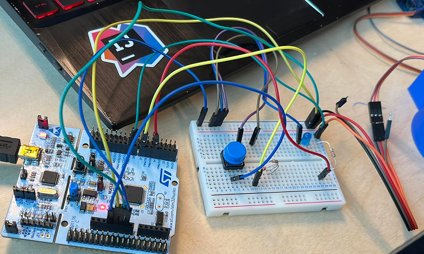

# SNOT

Safe Night Out Together

## Discord

Join het discord kanaal voor alle info en vragen: [Discord](https://discord.gg/33ayYHaHzA)

Zie ook:  [Redmine](https://project.devbit.be/projects/snot)

## Dop Design

Voorlopig hebben we een aantal designs gehad. Het laatste design is de blauwe dop.
Zie discord INFO/Design voor verdere info.

## PCB Design

Om de shield te laten werken moet je hem in SPI mode zetten. Voor SPI moet je SEL0 en SEL1 sluiten, je moet ze dus dichtsolderen of met een schakelaar connecteren.

Om de shield te verbinden met bv. een nucleo moet je 3 power pinnen(5V, 3V3 en GND) en 4 spi pinnen(MOSI, MISO, SCK, en CS/SS) verbinden.

Voor het elektronisch en PCB schema terug te vinden of meer info te krijgen ga je naar discord: INFO/PCB-Design

## Benodigdheden Software

- Installeren van Visual Studio Code: <https://code.visualstudio.com/> // + Benodigde extenties (zou moeten automatisch aanbieden welke je nodig hebt)
- Installeren van python: <https://www.academicsoftware.eu/software/27/265> // Take the lastest STABLE release
- Installeren van (mini)conda: <https://software-installation-guide.netlify.app/conda/>
- Installeren van mbed: <https://software-installation-guide.netlify.app/mbed/>
- Installeren van KiCad: <https://www.kicad.org/download/windows/> // CERN Switzerland
- Installeren van SolidEdge: <https://www.academicsoftware.eu/software/25/292>

Zorg er ook voor dat miniconda is toegevoegd aan je omgevings variabelen: bv. C:\Users\thybr\miniconda3\Scripts

## Code

Voor het binnenhalen van de code en overige:
```bash
git clone git@github.com:vives-project-xp/Snot.git
```

De volledige code is terug te vinden onder de file 'mbed'.
Indien je de schakeling wil testen zonder de NFC maar enkel met drukknoppen moet je de file 'cap' gebruiken

Voor het compileren van de code:

- Open powershell
- Conda create mbed (zie installation guide (mini)conda)
- Conda activate mbed (zie installation guide (mini)conda voor installatie extensies)
- Compileren van de code
```bash 
mbed compile -f
```
## Opstelling Cap 

Deze opstelling is voor het testen van de schakeling die in de cap gaat. Dit wordt vervangen door de zelf gemaakte pcb in de volgende fase.

## Benodigdheden Hardware

- Cap + valse bodem + dekseltje motor
- STM32L467RG voor compilatie
- PN532 (versie blauw) voor scannen van de NFC --> soort versie kan nog veranderen ondertussen
- Zelfgemaakte PCB wanneer werken voor STM te vervangen (zou moeten in cap passen)
- PN532 (versie rood) voor het scannen van de NFC (zou moeten in de cap passen)
- Alle bestelde hardware + deze solderen op de zelf gemaakte PCB

## TODO

- Alles implementeren in de kleinere versie (bestelde componenten + zelf ontworpen bordje)
- Implementeren van de neopixel (ws2812b) in de code