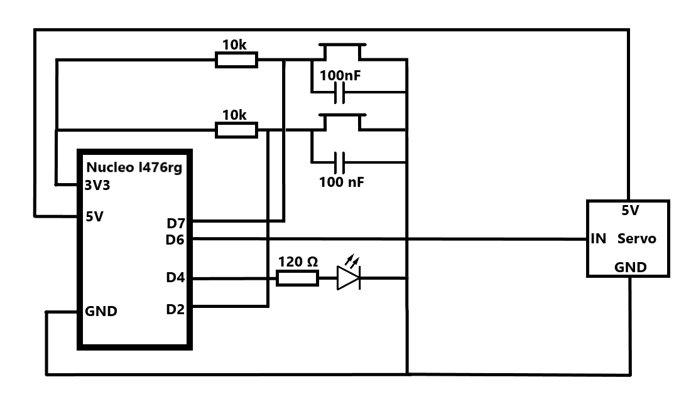

# SNOT

Safe Night Out Together is een project waar er wordt geprobeerd om spiking zo veel mogelijk tegen te houden. Wij hebben een dop ontwikkeld die dir probeerd tegen te houden. De bedoeling is dat je een nfc bandje scant op de dop en dat deze dan open zal gaan, als deze eraf wordt geforceerd zal er een lichtje branden, die de persoon inlicht om het drankje weg te gieten.

## Discord

Join het discord kanaal voor alle info en vragen: [Discord](https://discord.gg/33ayYHaHzA)

Zie ook:  [Redmine](https://project.devbit.be/projects/snot)

## Dop Design

Voorlopig hebben we een aantal designs gehad. Het laatste design is de blauwe dop.
Zie discord INFO/Design voor verdere info.


Dit is een foto van de dop, in het grote gat komt een servo motor, die het glas klem zet. Er zit ook nog een dubbele bodem in voor de pcb, maar die hebben we niet kunnen uittesten.


Dit is een foto van het deurtje dat de servo motor zal in plaats houden en beschermen.

## PCB Design

Om de shield te laten werken moet je hem in SPI mode zetten. Voor SPI moet je SEL0 en SEL1 sluiten, je moet ze dus dichtsolderen of met een schakelaar connecteren.

Om de shield te verbinden met bv. een nucleo moet je 3 power pinnen(5V, 3V3 en GND) en 4 spi pinnen(MOSI, MISO, SCK, en CS/SS) verbinden.

In het mapje bcp staat er een mapje snot_pcb. Hierin staat de kicad file voor de pcb, deze kan gebruikt worden om de pcb online te bestellen. Er staat ook een BOM lijst met de benodigde materialen. 


## Benodigdheden Software

- Installeren van Visual Studio Code: <https://code.visualstudio.com/> // + Benodigde extenties (zou moeten automatisch aanbieden welke je nodig hebt)
- Installeren van python: <https://www.academicsoftware.eu/software/27/265> // Take the lastest STABLE release
- Installeren van (mini)conda: <https://software-installation-guide.netlify.app/conda/>
- Installeren van mbed: <https://software-installation-guide.netlify.app/mbed/>
- Installeren van KiCad: <https://www.kicad.org/download/windows/> // CERN Switzerland
- Installeren van SolidEdge: <https://www.academicsoftware.eu/software/25/292>

Zorg er ook voor dat miniconda is toegevoegd aan je omgevings variabelen: bv. C:\Users\thybr\miniconda3\Scripts

## Code

Voor het binnenhalen van de code en overige:
```bash
git clone https://github.com/vives-project-xp/Snot.git
git checkout snot-v2
```

De volledige code is terug te vinden onder de file 'mbed'.
Indien je de schakeling wil testen zonder de NFC maar enkel met drukknoppen moet je de file 'cap' gebruiken

Voor het compileren van de code:

- Open powershell
- Conda create mbed (zie installation guide (mini)conda)
- Conda activate mbed (zie installation guide (mini)conda voor installatie extensies)
- Compileren van de code
```bash 
mbed compile -f
```

Er is ook code voor de box, maar die heeft zijn eigen README.md.
Deze code was van een vorig project en wij hebben die aangepast voor ons project. Er zijn teveel files die we niet gebruiken, maar alle klasses zijn met elkaar verbonden en hierdoor is het te veel werk om de bestanden te verwijderen die we niet gebruiken.

## Opstelling Cap 

[Hier](https://www.instagram.com/reel/CrSmLBvvxVR/?utm_source=ig_web_copy_link) is een demo van de opstelling.


Dit is de schakeling die gebruikt wordt in de demo, deze heeft 2 knoppen. 1 knop hiervan simuleert de nfc, omdat wij deze nog niet hebben. Het filmpje legt ook uit hoe deze precies werkt.

## Benodigdheden Hardware

- Cap + valse bodem + dekseltje motor
- STM32L467RG voor compilatie
- PN532 (versie blauw) voor scannen van de NFC --> soort versie kan nog veranderen ondertussen
- Zelfgemaakte PCB wanneer werken voor STM te vervangen (zou moeten in cap passen)
- PN532 (versie rood) voor het scannen van de NFC (zou moeten in de cap passen)
- Alle bestelde hardware + deze solderen op de zelf gemaakte PCB (zie mapje pcb)

## TODO

- De pcb solderen en dan NFC daarin implementeren